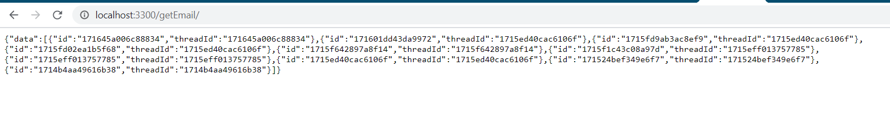
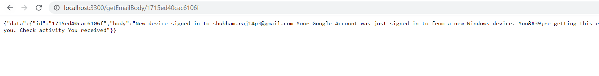

# Gmail API Implementaion

> Getting the mails from Gmail, reading the top 10 mails, getting the body

Getting Mail Ids :

Getting Mail body with selected Mail Id

## Built With

- Node JS,
- Gmail API,
- Express & Routes

To get a local copy up and running follow these simple example steps.

git clone https://github.com/shubham14p3/gmail-api-implementation.git

Note:
1. Run the following you need to first start server in localhost
2. Run GetMail Route to see the mail Ids
3. Copy any mail Id and run it with cascading it with Get Email Body route

## File required

- Node and NPM Installed,
- Gmail Api Access,
- Valid Credentials
- Node js client for gmail

## Authors

👤 **Author1**

- Github: [@shubham14p3](https://github.com/shubham14p3)
- Linkedin: [shubham14p3](https://linkedin.com/in/shubham14p3)

## 🤝 Contributing

Contributions, issues and feature requests are welcome!

Feel free to check the [issues page](https://github.com/shubham14p3/gmail-api-implementation/issues/).

## Show your support

Give a ⭐️ if you like this project!

## 📝 License

This project is [MIT](lic.url) licensed.
